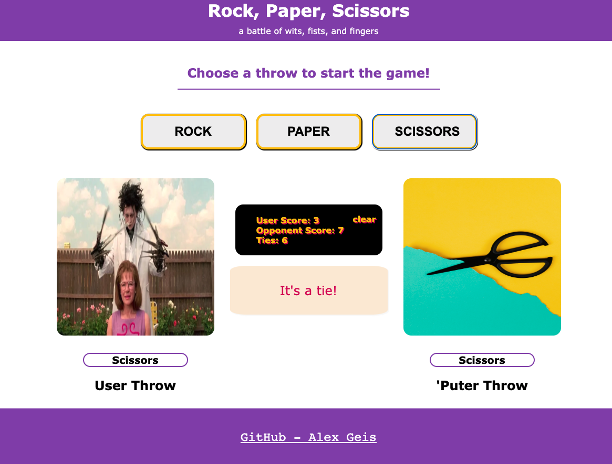

<div id="top"></div>

<!-- PROJECT SHIELDS -->
<!--
*** using markdown "reference style" links for readability.
*** Reference links are enclosed in brackets [ ] instead of parentheses ( ).
*** See the bottom of this document for the declaration of the reference variables
*** https://www.markdownguide.org/basic-syntax/#reference-style-links
-->

<!-- [![Contributors][contributors-shield]][contributors-url]
[![Forks][forks-shield]][forks-url]
[![Stargazers][stars-shield]][stars-url] -->

[![Issues][issues-shield]][issues-url]
[![MIT License][license-shield]][license-url]
[![LinkedIn][linkedin-shield]][linkedin-url]

<!-- PROJECT LOGO -->
<br />
<div align="center">
  <!-- <a href="https://github.com/alexgeis/R_P_S">
    
  </a> -->

<h3 align="center">Rock, Paper, Scissors</h3>

  <p align="center">
    This page is a rock, paper, scissors application w/ dynamic images and a scoreboard. A kitten vs. puppy showdown is shown on pageload and from there the user can play an infinite number of R/P/S games.
    <br />
    <a href="https://github.com/alexgeis/R_P_S"><strong>Explore the docs »</strong></a>
    <br />
    <br />
    <a id="deployed_link" href="https://alexgeis.github.io/R_P_S/">View Demo</a>
    ·
    <a href="https://github.com/alexgeis/R_P_S/issues">Report Bug</a>
    ·
    <a href="https://github.com/alexgeis/R_P_S/issues">Request Feature</a>
  </p>
</div>

<!-- TABLE OF CONTENTS -->
<details>
  <summary>Table of Contents</summary>
  <ol>
    <li>
      <a href="#about-the-project">About The Project</a>
      <ul>
        <li><a href="#built-with">Built With</a></li>
      </ul>
    </li>
    <!-- <li>
      <a href="#getting-started">Getting Started</a>
      <ul>
        <li><a href="#prerequisites">Prerequisites</a></li>
        <li><a href="#installation">Installation</a></li>
      </ul>
    </li> -->
    <li><a href="#usage">Usage</a></li>
    <li><a href="#roadmap">Roadmap</a></li>
    <li><a href="#contributing">Contributing</a></li>
    <li><a href="#license">License</a></li>
    <li><a href="#contact">Contact</a></li>
    <li><a href="#acknowledgments">Acknowledgments</a></li>
  </ol>
</details>

<!-- ABOUT THE PROJECT -->

## About The Project

<!-- [![Product Name Screen Shot][product-screenshot]](https://example.com) -->
<a href="https://example.com">
<p align="center">
</p></a>

Search and replace keywords: `deployed_link`, `product-screenshot`, `R_P_S`, `Rock, Paper, Scissors`, `This page is a rock, paper, scissors application w/ dynamic images and a scoreboard. A kitten vs. puppy showdown is shown on pageload and from there the user can play an infinite number of R/P/S games.`

<p align="right">(<a href="#top">back to top</a>)</p>

### Built With

Vanilla Javascript, CSS, and HTML

<p align="right">(<a href="#top">back to top</a>)</p>

<!-- GETTING STARTED -->
<!--
## Getting Started

Instructions on setting up your project locally.
To get a local copy up and running follow these simple example steps.

### Prerequisites

This is an example of how to list things you need to use the software and how to install them.

- npm
  ```sh
  npm install npm@latest -g
  ```

### Installation

1. Get a free API Key at [https://example.com](https://example.com)
2. Clone the repo
   ```sh
   git clone https://github.com/alexgeis/R_P_S.git
   ```
3. Install NPM packages
   ```sh
   npm install
   ```
4. Enter your API in `config.js`
   ```js
   const API_KEY = "ENTER YOUR API";
   ```

<p align="right">(<a href="#top">back to top</a>)</p> -->

<!-- USAGE EXAMPLES -->

## Usage

Choose a throw option (rock, paper, or scissors) and wait for the computer's turn to see if you won!

<!-- _For more examples, please refer to the [Documentation](https://example.com)_ -->

<p align="right">(<a href="#top">back to top</a>)</p>

<!-- ROADMAP -->

## Roadmap

- [ ] Turn javascript functions into the revealing module pattern
- [ ] API Integration for random images
- [ ] Storage of user scores (DB)
- [ ] CSS/JS Animations
- [ ] Scoreboard styling - something akin to an actual scoreboard
- [ ] Implement a nodeJS/express backend server
- [ ] PWA
- [ ] Deployment - ideally via [Netlify](https://www.netlify.com/)
- [ ] Winner/loser display improvement
  - [ ] more visuals around winners/losers. Specifically, some visual indicator to point to the winner (a large arrow in the middle, or something similar)

<!-- See the [open issues](https://github.com/alexgeis/R_P_S/issues) for a full list of proposed features (and known issues). -->

<p align="right">(<a href="#top">back to top</a>)</p>

<!-- CONTRIBUTING -->

## Contributing

Any contributions you make are **greatly appreciated**.

Please try to create bug reports that are:

- _Reproducible_. Include steps to reproduce the problem.
- _Specific_. Include as much detail as possible: which version, what environment, etc.
- _Unique_. Do not duplicate existing opened issues.
- _Scoped_ to a Single Bug. One bug per report.

If you have a suggestion that would make this better, please fork the repo and create a pull request. You can also simply open an issue with the tag "enhancement".
Don't forget to give the project a star! Thanks again!

1. Fork the Project
2. Create your Feature Branch (`git checkout -b feature/AmazingFeature`)
3. Commit your Changes (`git commit -m 'Add some AmazingFeature'`)
4. Push to the Branch (`git push origin feature/AmazingFeature`)
5. Open a Pull Request

<p align="right">(<a href="#top">back to top</a>)</p>

<!-- LICENSE -->

## License

Distributed under the MIT License. See `LICENSE.txt` for more information.

<p align="right">(<a href="#top">back to top</a>)</p>

<!-- CONTACT -->

## Contact

Alex Geis - siegxela@gmail.com

Project Link: [https://github.com/alexgeis/R_P_S](https://github.com/alexgeis/R_P_S)

<p align="right">(<a href="#top">back to top</a>)</p>

<!-- ACKNOWLEDGMENTS -->

## Acknowledgments

Helpful resources and kudos.

- [Choose an Open Source License](https://choosealicense.com)
- [Img Shields](https://shields.io)
- [GitHub Pages](https://pages.github.com)

<p align="right">(<a href="#top">back to top</a>)</p>

<!-- MARKDOWN LINKS & IMAGES -->
<!-- https://www.markdownguide.org/basic-syntax/#reference-style-links -->

<!-- [contributors-shield]: https://img.shields.io/github/contributors/alexgeis/R_P_S.svg?style=for-the-badge
[contributors-url]: https://github.com/alexgeis/R_P_S/graphs/contributors
[forks-shield]: https://img.shields.io/github/forks/alexgeis/R_P_S.svg?style=for-the-badge
[forks-url]: https://github.com/alexgeis/R_P_S/network/members
[stars-shield]: https://img.shields.io/github/stars/alexgeis/R_P_S.svg?style=for-the-badge
[stars-url]: https://github.com/alexgeis/R_P_S/stargazers -->

[issues-shield]: https://img.shields.io/github/issues/alexgeis/R_P_S.svg?style=for-the-badge
[issues-url]: https://github.com/alexgeis/R_P_S/issues
[license-shield]: https://img.shields.io/github/license/alexgeis/R_P_S.svg?style=for-the-badge
[license-url]: https://github.com/alexgeis/R_P_S/blob/master/LICENSE.txt
[linkedin-shield]: https://img.shields.io/badge/-LinkedIn-black.svg?style=for-the-badge&logo=linkedin&colorB=555
[linkedin-url]: https://linkedin.com/in/alexngeis
[product-screenshot]: ./assets/rps-screenshot.png
